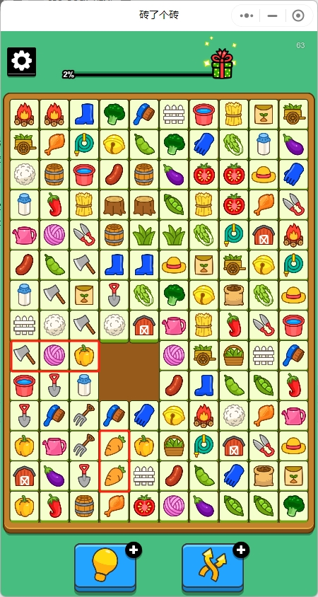

= 砖了个砖求解

== 游戏介绍

砖了个砖是一款休闲类微信小游戏，拖动砖块找到横向或纵向上可以直接连通的相同砖块后消除，所有砖块都消除后游戏成功；以上图为例，第十三行和第十四行的两个萝卜可以直接消除，第九行第一格的斧头可以向右移动两格后与上一行的斧头一起消除，注意此时斧头右侧的毛线球与辣椒也会随之向右移动两格，另外消除的砖块不必相邻只要直线上再没有其它砖块即可

该游戏的第四关难度很高，前期可以消除一部分砖块，但最后会剩下一部分砖块无论如何拖动都无法继续消除，此时系统会判定为游戏失败。想必是前期不能随意消除砖块，必须按照特定的顺序消除，此程序用于找到这个顺序，最终保证所有砖块都能消除，进而游戏通关

== 使用方法

1. 修改 `BrickConverter` 和 `BrickResolver` 中的文件目录 `C:/Users/pxzxj1/Desktop/brick` 为本地目录
2. 游戏截图保存到目录中，命名为 `brick.png`，截图时只截取中间砖块的部分
3. 执行 `BrickConverter`
4. 手动校准上一步生成的 `brick.txt` 文件
5. 执行 `BrickResolver` 查看控制台输出的答案，根据答案继续游戏

== 实现思路

== 图片转数组

所有砖块显然可以用二维数组来表示，同时要保证相同的砖块数组元素相等，例如可以使用特定数字来表示各个砖块。
手工定义这个数组费时费力，因此借助AI图片识别来实现

首先要从一张游戏截图中得到所有砖块及其对应位置，目前是使用Java API实现的图片切割，也许更好的方案是使用边缘识别

下一步从得到所有砖块的图片后下一步就是图片比对找到相同的图片，目前是使用 `opencv` 库来实现的，它能够计算得到一个图片相似度得分进而判定是否是同一个图片

理想情况下通过上面两个步骤就能得到最终需要的数组，不过目前图片相似度比对仍不完善，会出现把不同砖块识别为相同或者把相同砖块识别为不同的情况，因此把得到的数组保存为文件再人工校对一遍

最后一步就是从文件中读出数组进行核心的计算了

== 求解

与人工玩游戏的思路类似，求解过程实际上就是不断遍历，通过遍历找到直线上相同的砖块进行消除，通过遍历找到当前砖块相邻的连续砖块，通过遍历找到上下左右移动的边界，通过遍历找到移动过程中是否在直线上存在相同砖块

需要注意的是只有按照特定的顺序消除才能最终消除所有砖块，也就是说在某一种数组状态下可能存在多种拖动方案，此时要找到正确的那个拖动方案，由于按照错误的拖动继续执行时会修改当前数组的元素，因此在实际拖动前要保存当前数组的快照，如果按照一个拖动方案最终走到剩余部分砖块再也不能消除的情况就返回到原来的遍历点使用快照数据还原数组状态再继续尝试下一个拖动方案